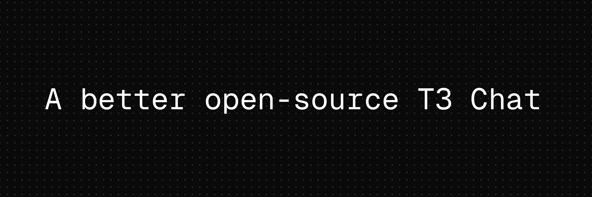

<p align="center">
	<h1 align="center"><b>next-t3.chat</b></h1>
<p align="center">
     A better open-source T3 Chat
    <br />
    <br />
    <a href="https://next-t3.chat">Website</a>
    ·
    <a href="https://github.com/evanssmaina/next-t3.chat/issues">Issues</a>
  </p>
</p>

## Features

- **Attachments Support:** Allow users to upload files (images and pdfs) ✅
- **Syntax Highllighting:** Beautiful code formatting and ✅
- **Chats Search Engine:** Powerful Search for search chats by title and messages
- **Chat Branching:** Create alternative conversation paths
- **Resumable Streams:** Continue generation after page refresh
- **Bring your own API Keys:** Bring your own API Keys
- **Web Search:** Real Time web search
- **Chat Sharing:** Share conversations with others

## Tech Stack

- **Frontend:** Nextjs, Tailwind CSS with Shadcn UI, Motion
- **AI:** Vercel AI SDK
- **Authentcation:** Clerk
- **Analytics & Error Tracking:** PostHog
- **Logging:** Axiom 
- **URL State Management:** Nuqs
- **Data Fetching:** trpc with tanstack react query
- **Backend:** Nextjs API route handlers
- **Database:** Neon Postgres
- **ORM:** Drizzle ORM
- **Rate-Limiting:** Upstash Ratelimit
- **Caching:** Upstash Redis
- **Deployment:** Vercel 
- **Formating & Linting:** Biome
- **Chats Search Engine:** Upstash Search

## AI Models Supported

- Gemini 2.5 Flash
- Gemini 2.5 Flash Thinking
- Gemini 2.0 Flash 
- Gemini 2.0 Flash Lite

## Getting Started

### 1. Clone from GitHub

```bash
git clone https://github.com/evanssmaina/next-t3.chat.git
cd next-t3.chat
```

### 2. Install Dependencies

Choose your preferred package manager:

**Using npm:**
```bash
npm install
```

**Using pnpm:**
```bash
pnpm install
```

**Using bun:**
```bash
bun install
```

### 3. Setup Environment Variables

Copy the example environment file and configure your variables:

```bash
cp .env.example .env
```

Then edit `.env` with your specific configuration values.


## License

Licensed under the [MIT license](https://github.com/evanssmaina/next-t3.chat/blob/main/LICENSE.md).